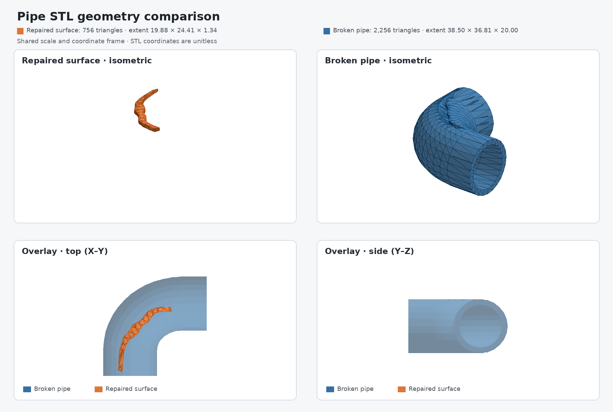

# Physical AI Repair Scanner

> Built for the **Physical AI Hackathon 2026**

**Physical AI · RGB-D Computer Vision · 3D Reconstruction · Point Clouds ·
Digital Twins · Human-in-the-Loop AI · Smart Manufacturing**

This project is an intelligent object scanner for the reconstruction and repair
domain. It uses an Intel RealSense D435-series RGB-D camera to capture damaged
objects from multiple viewpoints, reconstruct their geometry, and identify the
region that needs to be filled or repaired.

A ChArUco board gives every capture a shared world coordinate frame. The
platform combines color-guided object detection, multi-view point-cloud
reconstruction, automatic repair segmentation, and manual repair alignment in
one browser-based workflow.

## Project concept



The example above compares a broken pipe with its segmented repair surface. The
orange geometry represents the area that can be filled to reconstruct the
damaged part.

## Demo


## Features

1. **Color-guided object detection** — the RealSense D435 captures synchronized
   RGB and depth data and keeps points that match a predefined reference color.
2. **Session-based scanning** — the user starts a named recording session and
   clicks **Capture** to add each RGB-D observation.
3. **ChArUco world coordinates** — a printable board is provided in
   [`src/board_resources/ChArUco`](src/board_resources/ChArUco). The board and
   object must both be visible during capture. At least 20 ChArUco corners must
   be detected before a frame is accepted.
4. **Live reconstruction preview** — pausing or stopping a recording processes
   the accepted captures and previews the reconstructed point cloud collected
   so far.
5. **Repair analysis and adjustment** — automatic segmentation extracts the
   proposed repair region, while **Adjust repair** lets the user manually place
   and align the repair part on the reconstructed object.

## Workflow

1. Print the ChArUco board at **100% / Actual size**.
2. Place the target object beside the board and keep both visible to the camera.
3. Select the object's reference color and start a recording session.
4. Move the camera around the object and click **Capture** at each viewpoint.
5. Pause or stop the session to inspect the fused 3D reconstruction.
6. Run **Analyze** to segment the missing region, then use **Adjust repair** for
   human-in-the-loop placement.

## Technology stack

- **ROS 2 Jazzy** for camera, transformation, and recording services
- **Intel RealSense D435-series** RGB-D sensing and colored point clouds
- **OpenCV ChArUco** for camera pose estimation and spatial registration
- **Open3D** for point-cloud cleaning, alignment, fusion, and reconstruction
- **Flask + Three.js** for the interactive 3D web interface
- **SQLite** for reproducible per-session scan storage

## Build and run

Requirements: Ubuntu with ROS 2 Jazzy, librealsense 2.58 or newer, an Intel
RealSense D435-series camera, and Python 3.12.

```bash
sudo apt install python3.12-venv
python3 -m venv --system-site-packages .venv_scanner
source .venv_scanner/bin/activate
python -m pip install open3d-cpu==0.19.0 "scipy>=1.15.0" \
  "scikit-learn>=1.6.0"

source /opt/ros/jazzy/setup.bash
colcon build --symlink-install \
  --packages-select realsense2_camera_msgs realsense2_camera \
  realsense_camera_ros object_scanner_interfaces object_scanner \
  object_scanner_processing object_scanner_web \
  --cmake-args -DPython3_EXECUTABLE="$VIRTUAL_ENV/bin/python" \
  -DCMAKE_EXPORT_COMPILE_COMMANDS=ON \
  -DCMAKE_BUILD_TYPE=Debug
ln -sf build/compile_commands.json compile_commands.json
source install/setup.bash
ros2 launch object_scanner_web object_scanner_web.launch.py
```

Open [http://localhost:5000](http://localhost:5000) to use the scanner.

Each session is saved under `scans/<session_name>/` with the raw capture,
aligned reconstruction, and transformation metadata.
